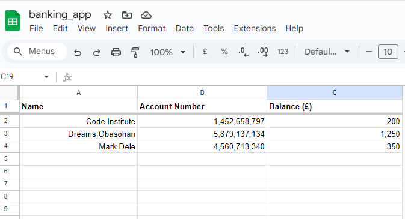
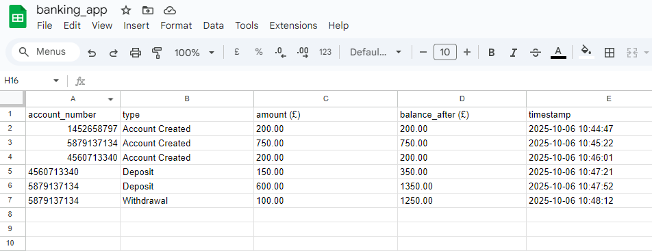
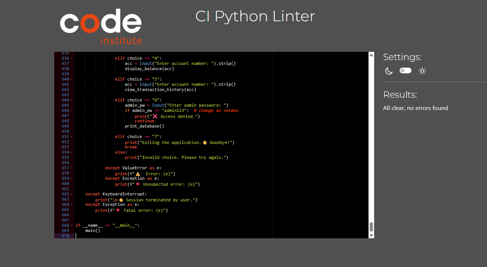

# 🏦 Banking App (Google Sheets Integration)


A simple **Python-based banking system** that uses **Google Sheets** as a cloud database for managing accounts, balances, and transactions.  
This app provides a lightweight, interactive banking console without needing SQL — all data syncs live with Google Sheets.

---

## 🚀 Features

✅ **Account Management**
- Create accounts with automatically generated 10-digit account numbers.  
- Cleans and validates all account numbers for uniqueness.  

✅ **Deposits & Withdrawals**
- Add or withdraw funds instantly.  
- Updates Google Sheets in real-time and logs all transactions.  

✅ **Balance Display**
- View live balances directly from Google Sheets.  

✅ **Transaction History**
- View the 10 most recent transactions for any account in a formatted table.  

✅ **Admin Dashboard**
- Print all accounts and balances (admin password required).  

✅ **Error Handling**
- Gracefully handles invalid input, missing worksheets, and malformed data.  

---

## 🧰 Resources


- **Python 3.8+**
- Required libraries:
  ```bash
  pip install gspread google-auth prettytable
  ```
- Google Cloud project with:
  - **Google Sheets API**
  - **Google Drive API**
  - **Heroku** – Application deployment platform 
- Service account credentials file: `creds.json`

---

## ⚙️ Setup Instructions

### 1️⃣ Enable Google APIs
1. Go to the [Google Cloud Console](https://console.cloud.google.com/).
2. Create or select a project.
3. Enable these APIs:
   - Google Sheets API  
   - Google Drive API
4. Create a **service account**, download the JSON credentials file, and rename it to `creds.json`.

### 2️⃣ Share the Spreadsheet
1. Create a new Google Sheet named **`banking_app`**.  
2. Add two sheets (tabs):
   - `accounts`
   - `transactions`
3. Share the spreadsheet with your **service account email** (found in `creds.json`) and give it **Editor** access.

---

## 📚 Libraries

- [random](https://docs.python.org/3/library/random.html) – Used to generate random account numbers  

---

## ✅ Validation

All code was checked against the **PEP8** Python style guide using the [PEP8 validator](https://pypi.org/project/pep8/).  
Where long lines caused functional issues after shortening, they were intentionally kept longer to maintain app stability.

## 📸 Screenshots








---

### 3️⃣ Save Your Files
Place the following in the same folder:
```
banking_app/
├── banking.py
├── creds.json
└── README.md
```

---

## ▶️ Running the App

Launch from your terminal:
```bash
python banking.py
```

You’ll see:
```
🏦 Welcome to the Banking App
====================================
1. Create Account
2. Withdraw Funds
3. Deposit Funds
4. Display Balance
5. View Transaction History
6. Print Database (Admin)
7. Exit
====================================
```

---

## 💡 Example Usage

### 🆕 Create an Account
```
Enter account name: John Doe
Enter initial balance (£): 500
```
**Output:**
```
✅ Account created successfully!
👤 Name: John Doe
💳 Account Number: 1234567890
💰 Initial Balance: £500.00
```

### 💰 Deposit Funds
```
Enter account number: 1234567890
Enter deposit amount (£): 250
```
**Output:**
```
✅ Deposited £250.00. New balance: £750.00
```

### 💸 Withdraw Funds
```
Enter account number: 1234567890
Enter withdrawal amount (£): 100
```
**Output:**
```
✅ Withdrawal successful! £100.00 withdrawn.
💰 New balance: £650.00
```

### 📊 Display Balance
```
Enter account number: 1234567890
```
**Output:**
```
📊 Current balance for 1234567890: £650.00
```

### 📋 View Transactions
Shows the last 10 transactions in a clean PrettyTable format.

---

## 🔐 Admin Access

To view all accounts:
```
Enter admin password: admin123
```

## 🧱 File Structure

```
banking_app/
│
├── banking.py        # Main application file
├── creds.json        # Google service account credentials
└── README.md         # Documentation
```

---

## ⚠️ Notes & Tips

- Automatically detects missing worksheets and creates them.  
- Handles malformed data, invalid input, and header variations.  
- Works across Windows, macOS, and Linux.  
- All data updates in Google Sheets are **instant** and **persistent**.  

---

## 🌐 Deployment

### Deploying to Heroku

This application was deployed to **Heroku** using the following steps:

1. Create or log into your Heroku account at [heroku.com](https://www.heroku.com).  
2. Create a new app, enter a unique name (e.g., *banking-app-p3*), and choose your region.  
3. Go to **Settings** → **Config Vars** and add:
   - `CRED` → your Google API key (copied from your `.json` credentials file)  
   - `PORT` → `8000`
4. Add buildpacks under **Settings**:
   - Python (top)
   - Node.js (bottom)
5. Go to **Deploy** → **Deployment Method** → select **GitHub**.  
6. Connect your Heroku app to your GitHub repository.  
7. Choose your deployment branch and optionally enable **Automatic Deploys**.  
8. Click **Deploy Branch**.  
9. When the build finishes, click **View** to open your live app.

---

## 🧑‍💻 Author

**Developed by:** [Dreams Clement Obasohan]  
**Tech Stack:** Python, Google Sheets API, PrettyTable  

---

## 🙌 Credits

- **YouTube Tutorial:** [Bro Code](https://www.youtube.com/watch?v=8aW3tkIul-8&t=705s) – for practical solutions and inspiration.  
- **Code Institute:** [Code Institute](https://www.codeinstitute.net) – for foundational code and learning materials used in this project. 

- Peer-review slack channel for help trying to find any issues/break the code.

- **Jubril Akolade** - My Code Institute Mentor for his understanding.

---
